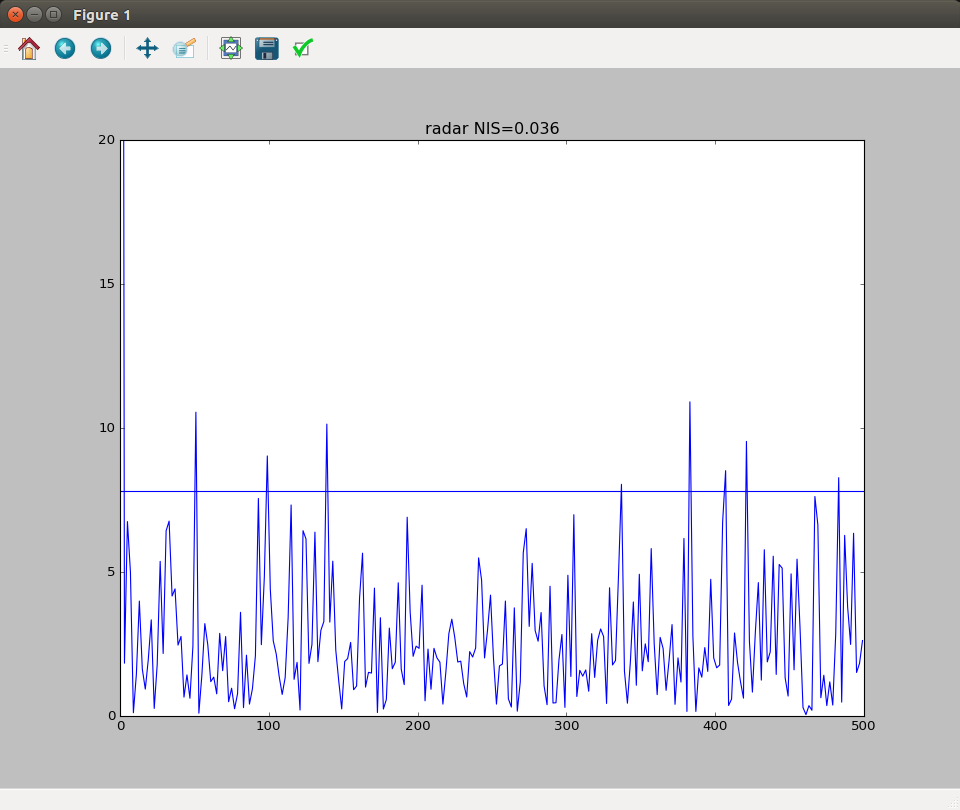
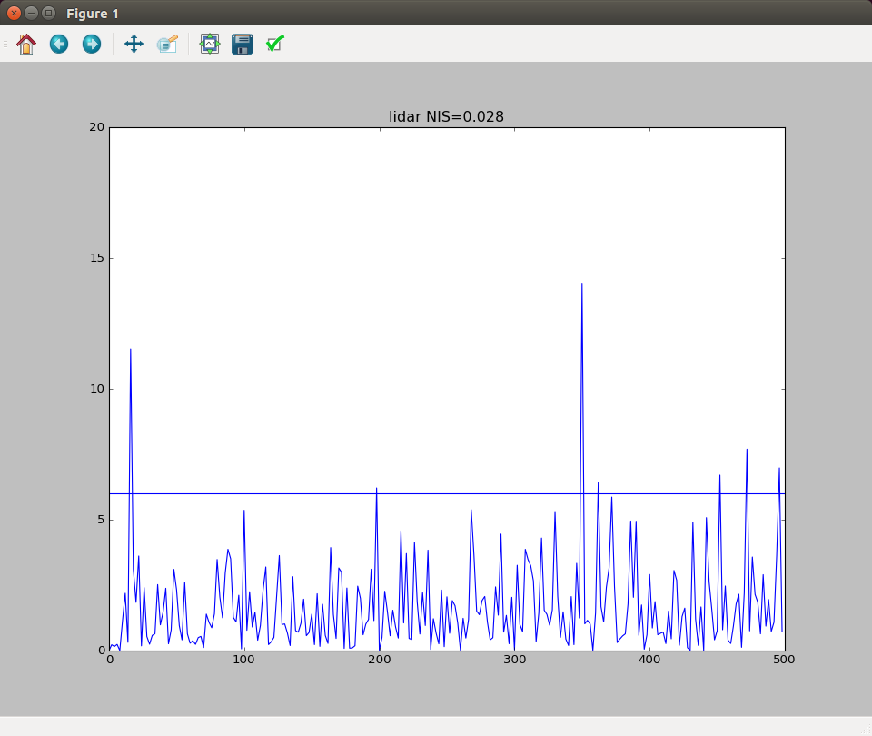
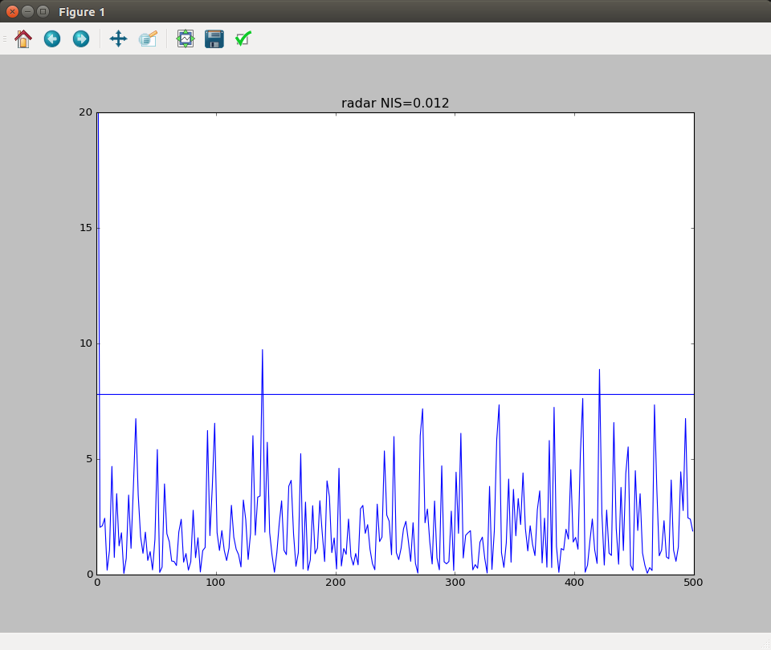
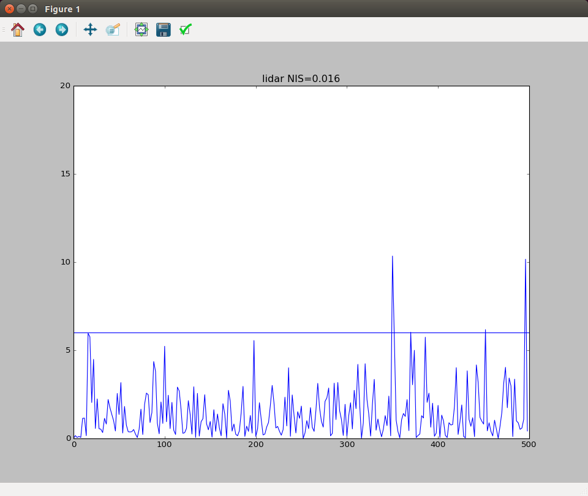
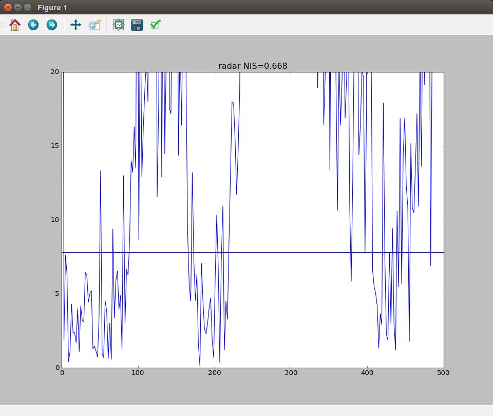
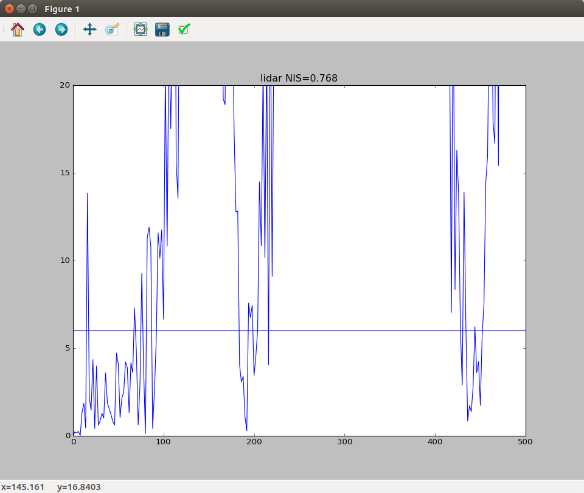

# Unscented Kalman Filter Project NIS
Self-Driving Car Engineer Nanodegree Program

---
## NIS
A tool showes NIS in tools/nis_ana.py
When adjust sta_a and sta_yadd, the result of RMSE and NIS:

### sta_a = 3, sta_yawdd=1
RMSE = {0.075046, 0.084257, 0.357629, 0.249277}

Radar NIS

Lidar NIS

### sta_a=30, sta_yawdd=30
RMSE = {0.099771, 0.118847, 0.894729, 0.993396}

Radar NIS

Lidar NIS

### sta_a = 0.2, sta_yawdd = 0.01
RMSE = {1.055904, 0.841231, 1.422729, 1.090028}

Radar NIS

Lidar NIS

---
## Dependencies

* cmake >= v3.5
* make >= v4.1
* gcc/g++ >= v5.4

## Basic Build Instructions

1. Clone this repo.
2. Make a build directory: `mkdir build && cd build`
3. Compile: `cmake .. && make`
4. Run it: `./UnscentedKF path/to/input.txt path/to/output.txt`. You can find
   some sample inputs in 'data/'.
    - eg. `./UnscentedKF ../data/obj_pose-laser-radar-synthetic-input.txt`

## Editor Settings

We've purposefully kept editor configuration files out of this repo in order to
keep it as simple and environment agnostic as possible. However, we recommend
using the following settings:

* indent using spaces
* set tab width to 2 spaces (keeps the matrices in source code aligned)

## Code Style

Please stick to [Google's C++ style guide](https://google.github.io/styleguide/cppguide.html) as much as possible.

## Generating Additional Data

This is optional!

If you'd like to generate your own radar and lidar data, see the
[utilities repo](https://github.com/udacity/CarND-Mercedes-SF-Utilities) for
Matlab scripts that can generate additional data.

## Project Instructions and Rubric

This information is only accessible by people who are already enrolled in Term 2
of CarND. If you are enrolled, see [the project page](https://classroom.udacity.com/nanodegrees/nd013/parts/40f38239-66b6-46ec-ae68-03afd8a601c8/modules/0949fca6-b379-42af-a919-ee50aa304e6a/lessons/c3eb3583-17b2-4d83-abf7-d852ae1b9fff/concepts/f437b8b0-f2d8-43b0-9662-72ac4e4029c1)
for instructions and the project rubric.
